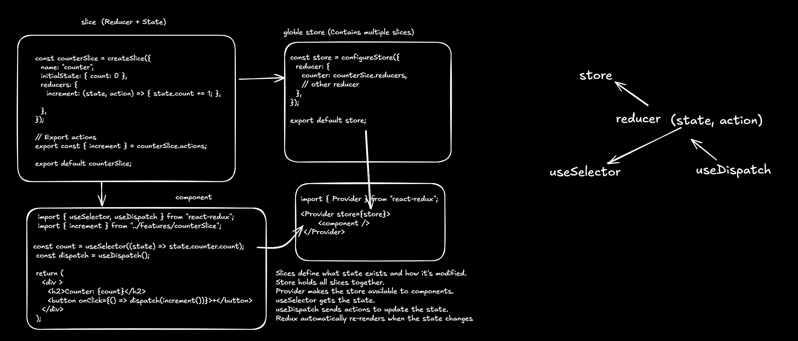

# Redux Toolkit (RTK) - Short Notes

## 🚀 What is Redux Toolkit (RTK)?
Both Redux Toolkit (RTK) and Context API help in managing global state in React, 



## 🔥 Key Features
- **Simplifies Redux setup** with `configureStore()`.
- **Built-in support for slices** using `createSlice()`.
- **Handles immutable updates efficiently**.
- **Includes middleware like Redux Thunk for async logic**.

## 🛠 RTK Workflow
1. **Create a Slice** - Define state and reducers.
2. **Configure Store** - Combine slices and create the store.
3. **Provide Store** - Use `<Provider>` to wrap the app.
4. **Use State & Dispatch** - Use `useSelector()` to read state and `useDispatch()` to update it.

## 📌 Example Code
```js
import { configureStore, createSlice } from "@reduxjs/toolkit";
import { Provider, useSelector, useDispatch } from "react-redux";

const counterSlice = createSlice({
  name: "counter",
  initialState: { count: 0 },
  reducers: {
    increment: (state) => { state.count += 1; },
  },
});

export const { increment } = counterSlice.actions;
const store = configureStore({ reducer: { counter: counterSlice.reducer } });

const Counter = () => {
  const count = useSelector((state) => state.counter.count);
  const dispatch = useDispatch();
  return (
    <div>
      <h2>Counter: {count}</h2>
      <button onClick={() => dispatch(increment())}>+</button>
    </div>
  );
};

const App = () => (
  <Provider store={store}>
    <Counter />
  </Provider>
);
